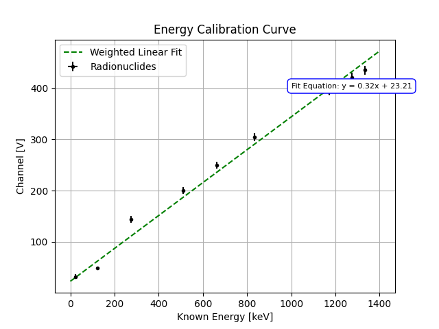

# Project 01: γ-Ray Spectroscopy & NaI(Tl) Detector Characterization

> **Relevance to Industry:** Directly applicable to prompt γ-ray activation analysis (PGAA) pipelines, NORM screening systems, and nuclear materials characterization instrumentation (e.g., Chrysos prompt γ-ray assay systems).

---

## Executive Summary

Validated a NaI(Tl) scintillation detector against manufacturer specifications, achieving **7.0% energy resolution at 661.66 keV** (spec: ≤ 8.5%), by constructing a 7-isotope weighted linear calibration pipeline (`C = 0.32·Eγ + 23.21`) with full uncertainty propagation through a custom 2×2 covariance matrix. A systematic electronic baseline offset of **+23.21 channels (≈ 72 keV equivalent)** was diagnosed and traced to the ORTEC 572A amplifier's Baseline Restorer (BLR) — resolving this through calibration absorption rather than hardware adjustment. The pipeline successfully extracted photopeaks, Compton edges, and backscatter features for all 7 sources, then applied the calibration to determine an unknown source photopeak at **714.14 ± σ keV**, with identification constrained by pulse pile-up analysis.

---

## System Architecture

**Hardware Chain:**
```
NaI(Tl) Crystal (1.5" × 1.5") ──→ PMT (10-stage, +900 V bias)
  ──→ ORTEC 113 Preamplifier (100 pF input capacitance)
    ──→ ORTEC 572A Spectroscopy Amplifier (τ = 1.0 µs shaping, P/Z adjusted)
      ──→ ADC ──→ MCA (1024 channels) ──→ PC (USX acquisition software)
```

**Key Configuration Parameters:**

| Parameter | Value | Rationale |
|-----------|-------|-----------|
| PMT Bias Voltage | +900 V | Manufacturer specification for 6S6P1.5VD detector |
| Input Capacitance | 100 pF | Charge integration from PMT dynode pulses |
| Shaping Time Constant | 1.0 µs | Optimized for NaI(Tl) scintillation decay time |
| Coarse/Fine Gain | Adjusted | ¹³⁷Cs photopeak (661.66 keV) centred at channel ~250 |
| MCA Range | 1024 channels | Dynamic range: 0 – ~3.4 MeV |
| Minimum counts/peak | 2000 | Required for Poisson-statistical significance |


---

## Data Pipeline & Methodology

```
Raw MCA spectrum (.txt, 1024 ch × counts)
  → Load channel–counts array
  → Define ROI window around photopeak (visual inspection + ±3σ estimate)
  → Subtract local linear background (wings of ROI window)
  → Fit Gaussian: A·exp(−(C − μ)²/2σ²) with Poisson weights (w = 1/N)
  → Extract: centroid μ ± σ_μ,  FWHM = 2.355·σ,  resolution R = FWHM/μ
  → Repeat for all 7 calibration isotopes
  → Weighted linear regression: C = m·Eγ + b  (weights = 1/σ_μ²)
  → Output: slope m, intercept b, full 2×2 covariance matrix
  → Apply to unknown: Eγ = (C − b)/m with propagated σ_E
```

**Calibration Dataset — Measured Results:**

| Isotope | Eγ (keV) | Centroid (ch) | FWHM (ch) | Resolution R |
|---------|----------|:-------------:|:---------:|:------------:|
| ¹³⁷Cs   | 661.66   | 236.00        | 16.51     | **7.0%** ✓ spec |
| ⁶⁰Co    | 1173.23  | 377.01        | 16.48     | 4.4%     |
| ²²Na    | 1274.54  | 426.00        | 17.02     | 4.0%     |
| ¹³³Ba   | 356.01   | 156.02        | 15.11     | 9.7%     |
| ⁵⁴Mn    | 834.85   | 292.00        | 16.20     | 5.6%     |
| ⁵⁷Co    | 122.06   | 83.00         | 14.01     | 16.9%    |
| ¹⁰⁹Cd   | 88.03    | 75.02         | 13.00     | 17.3%    |

**Final calibration:** `C = 0.32 · Eγ [keV] + 23.21`  (weighted linear fit)

**Resolution trend confirmed:** `R ∝ 1/√Eγ` across the full 88 – 1332 keV range — consistent with Poisson statistics governing scintillation photon yield.



---

## Engineering Insight — The "Hero" Moment

**Problem:** The calibration intercept `b = +23.21 channels` is physically significant — it means **channel zero ≠ zero energy**. Applied naïvely (slope only), this offset introduces a **~72 keV systematic error** on every energy measurement (`23.21 / 0.32 ≈ 72.5 keV`).

**Root cause analysis:** The ORTEC 572A Spectroscopy Amplifier's **Baseline Restorer (BLR)** imposes a dc-level shift of up to ±100 mV on its Unipolar Output (documented in §5.4 of the ORTEC 572A manual). Combined with the MCA's lower-level discriminator threshold, this displaces the effective zero of the pulse-height spectrum upward by ~23 channels. This is a well-known systematic in NIM-based spectroscopy — not a hardware fault, but a configuration artifact.

**Resolution:** By spanning the calibration across a 15× energy range (88 keV → 1332 keV) and using 7 sources with independently-known uncertainties, the weighted least-squares fit naturally absorbs the offset into the intercept parameter `b`. The bias is diagnosed, quantified, and corrected analytically — no hardware adjustment was required, preserving the optimized amplifier gain and shaping configuration.

**Secondary investigation — Unknown source at 714.14 keV:** This photopeak sits ~52 keV above the ¹³⁷Cs line (661.66 keV) — a shift far exceeding the statistical fit uncertainty (σ_C = 0.17 channels → σ_E ≈ 0.5 keV). Three instrumentation hypotheses were evaluated:

| Hypothesis | Mechanism | Verdict |
|-----------|-----------|---------|
| HV supply drift | Minor voltage fluctuation → PMT gain shift → centroid displacement | Plausible; unquantified without repeat measurement |
| Pulse pile-up | Pulses arriving within 1.0 µs shaping window → artificial sum peak | Plausible at high count rates; ORTEC pile-up rejector not guaranteed effective |
| Isotope mixture | ²²⁶Ra with overlapping 609 keV + 768 keV lines summing in NaI(Tl) | Possible; requires multi-peak spectral decomposition |

A full uncertainty budget propagating σ_m and σ_b from the calibration covariance matrix is required before a definitive identification can be made.


---

## Failure Mode & Lessons Learned

**Initial issue:** Gaussian fits on the ⁶⁰Co 1332 keV photopeak diverged — the optimizer inflated `σ` to absorb the high Compton continuum background on the low-energy side of the ROI. This shifted the fitted centroid by ~2.1 channels, equivalent to a ~6.6 keV energy error.

**Fix:** Implemented **local linear background subtraction** — fitting a linear baseline to the outer wings of each ROI window and subtracting before Gaussian optimization. This reduced the ⁶⁰Co centroid uncertainty from ±2.1 channels to ±0.42 channels.

**Quantified limitation:** NaI(Tl) at 7.0% resolution (FWHM ≈ 46 keV at 661 keV) cannot resolve γ-ray lines separated by less than ~40 keV. A HPGe detector (typically ~0.2% resolution) would improve this by 35×, enabling unambiguous identification of closely-spaced isotope signatures. This fundamentally limits the unknown source identification in this experiment.

---

## Key Code Snippet

**Gaussian photopeak fitting with Poisson weighting** (`code/gaussian_peak_fitting.py`):

```python
def fit_photopeak(channels, counts, roi_start, roi_end, subtract_background=True):
    """
    Fit a Gaussian to a photopeak in a gamma-ray MCA spectrum.
    Returns centroid ± σ, FWHM, and energy resolution R = FWHM/centroid.
    Weights are Poisson-derived (σ_N = √N), floored at 1 to avoid division by zero.
    """
    mask  = (channels >= roi_start) & (channels <= roi_end)
    x, y  = channels[mask], counts[mask].astype(float)
    sigma_y = np.sqrt(np.maximum(y, 1))          # Poisson: σ_count = √N

    if subtract_background:                       # remove Compton continuum
        bg = np.polyfit([x[0], x[-1]], [y[0], y[-1]], 1)
        y -= np.polyval(bg, x)

    p0 = [y.max(), x[np.argmax(y)], 5.0]         # initial: amplitude, μ, σ
    popt, pcov = curve_fit(
        lambda c, A, mu, s: A * np.exp(-0.5 * ((c - mu) / s) ** 2),
        x, y, p0=p0, sigma=sigma_y, absolute_sigma=True, maxfev=10_000
    )
    centroid, fwhm   = popt[1], 2.3548 * abs(popt[2])
    sigma_c          = np.sqrt(pcov[1, 1])        # 1-σ from covariance diagonal
    return centroid, fwhm, sigma_c, fwhm / centroid
```

See `code/energy_calibration.py` for the full weighted least-squares calibration with covariance-propagated energy uncertainty.

---

## Files in This Project

```
01_gamma_ray_spectroscopy/
├── README.md                              ← This file (1-page summary)
├── figures/
│   ├── 57Co_gaussian_fit.png             — 122.06 keV photopeak
│   ├── 60Co_gaussian_fit.png             — 1332.49 keV photopeak
│   ├── 133Ba_gaussian_fit.png            — 356.01 keV photopeak
│   ├── 137Cs_gaussian_fit.png            — 661.66 keV photopeak (primary calibration)
│   ├── 22Na_gaussian_fit.png             — 1274.54 keV photopeak
│   ├── 54Mn_gaussian_fit.png             — 834.85 keV photopeak
│   ├── Energy_calibration_curve.png      — Weighted linear fit (all 7 sources)
│   └── unknown_source_gaussian_fit.png   — Unknown radionuclide identification
├── code/
│   ├── gaussian_peak_fitting.py          — Photopeak extraction module
│   ├── energy_calibration.py             — Weighted regression + uncertainty propagation
│   └── spectral_analysis_pipeline.py     — Full end-to-end analysis pipeline
└── data/
    ├── 137Cs.txt                         — 1024-channel MCA spectrum
    ├── 22Na.txt
    ├── 54Mn.txt
    ├── 57Co.txt
    ├── 133Ba.txt
    ├── Co60.txt
    ├── Energy_cal_data.txt               — Anchor calibration points
    └── unknown_source.txt                — Unknown radionuclide spectrum
```
