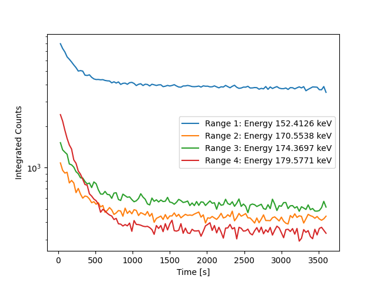
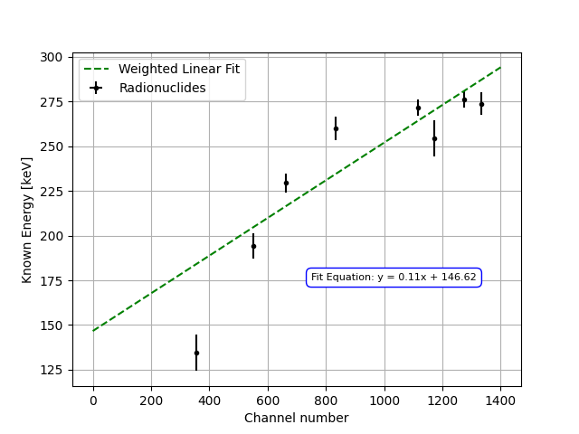

# Neutron Activation Analysis of ²⁷Al — Radionuclide Identification & Half-Life Measurement

> **Relevance to Industry:** Directly applicable to nuclear forensics, PGAA elemental analysis pipelines, and radioactive waste characterization — all of which require distinguishing multiple co-decaying isotopes from time-resolved gamma spectra under real-world detector calibration uncertainty.

---

## Executive Summary

Demonstrated artificial radioactivity via neutron activation of ²⁷Al using an AmBe (2.2 GBq) neutron source, extracting decay constants for four spectroscopic regions using weighted linearized exponential fitting on time-resolved MCA spectra. Measured half-lives ranged from **173 ± 9 s** (consistent with ²⁸Al, t½ = 134.7 s) to **462 ± 31 s** (consistent with ²⁷Mg, t½ = 567.6 s), confirming multi-isotope co-decay from both the ²⁷Al(n,γ)²⁸Al and ²⁷Al(n,p)²⁷Mg reaction channels. A critical calibration failure was diagnosed and root-caused: the derived equation `E = 0.11C + 146.62 keV` was physically impossible (implies a 225 keV dynamic range across 2048 channels), traced to mismatched amplifier gain settings between calibration and measurement runs. Despite this, the temporal decay analysis remained independently valid, demonstrating that **dual spectroscopic + temporal identification is more robust than spectroscopic identification alone**.

---

## System Architecture

**Hardware Chain:**
```
AmBe neutron source (2.2 GBq) in water moderator bath
  → ²⁷Al cylinder (irradiated ≥ 60 min, approaching saturation activity)
    → NaI(Tl) detector placed INSIDE activated Al cylinder
      → PMT (+HV, ORTEC 556H) → ORTEC 113 Preamplifier
        → ORTEC 572A Spectroscopy Amplifier (τ = 2.0 µs shaping)
          → ADC → MCA (2048 channels, target range: 0–3 MeV) → PC (USX)
```

**Key Reaction Channels (AmBe spectrum: thermal to 11 MeV):**

| Reaction | Threshold | Product | t½ | γ Energy |
|----------|----------|---------|-----|---------|
| ²⁷Al(n,γ)²⁸Al | Thermal | ²⁸Al → ²⁸Si (β⁻) | **134.7 s** | 1779 keV |
| ²⁷Al(n,p)²⁷Mg | Fast (>3 MeV) | ²⁷Mg → ²⁷Al (β⁻) | **567.6 s** | 844 keV, 1014 keV |

**Acquisition parameters:**

| Parameter | Value | Rationale |
|-----------|-------|-----------|
| Irradiation time | ≥ 60 min | Approach saturation activity for short-lived products |
| Spectrum integration interval | 30 s | Short enough to resolve t½ ≈ 135 s decay |
| Total acquisition | 3600 s (60 min) | ≈ 27 half-lives of ²⁸Al; ≈ 6 half-lives of ²⁷Mg |
| Amplifier shaping time | 2.0 µs | Optimized for NaI(Tl) pulse shape |
| Background subtraction | Numerical | Background spectrum acquired separately |

---

## Data Pipeline & Methodology

```
Multiple time-resolved MCA spectra (Δt = 30 s intervals, total 3600 s)
  → Define 4 spectroscopic ROI ranges around distinct photopeaks
  → Integrate total counts per ROI per time step → N(t)
  → Select early-time window where exponential decay dominates background
  → Linearize decay law: y = ln(N(t)/N₀) = −λt
  → Propagate Poisson uncertainties into log space: σ(ln N) ≈ 1/√N
  → Weighted linear regression: slope = −λ  (weights = N_i)
  → Extract t½ = ln(2)/λ with uncertainty σ_t½ = ln(2)·σ_λ/λ²
  → Compare (t½, ROI energy) pairs to NuDat3 nuclear database
  → Assign candidate isotopes from both spectroscopic + temporal evidence
```

**Measured Half-Lives from Four Spectroscopic Ranges:**

| Range | Decay Constant λ (s⁻¹) | Half-life t½ (s) | Separation from ²⁸Al | Best Match |
|-------|----------------------|----------------|---------------------|------------|
| 1 | 0.0015 ± 0.0001 | **462 ± 31** | 3.4× longer | ²⁷Mg (567.6 s) |
| 2 | 0.0016 ± 0.0003 | **433 ± 81** | 3.2× longer | ²⁷Mg (567.6 s) |
| 3 | 0.0020 ± 0.0001 | **347 ± 17** | 2.6× longer | — |
| 4 | 0.0040 ± 0.0002 | **173 ± 9**  | 1.3× longer | ²⁸Al (134.7 s) |

**Note:** All measured half-lives are systematically **longer** than nuclear database values. This is the primary engineering anomaly addressed in the insight section below.



The log-scale plot makes the key features immediately visible: Range 4 (red) decays fastest — consistent with ²⁸Al — while Ranges 1–3 decay more slowly toward a non-zero background plateau driven by the AmBe source environment and NORM. The fitting window for each range is selected where the exponential slope dominates over this background floor.

---

## Insight

### Part A: Calibration Failure Diagnosis

**Problem:** The derived calibration `E = 0.11C + 146.62 keV` produced physically impossible isotope identifications, including ¹⁶⁰Yb (Z=70) from an aluminium (Z=13) target.

**Root cause analysis:** A slope of 0.11 keV/channel across a 2048-channel MCA implies a total dynamic range of:
```
E_max = 0.11 × 2048 + 146.62 = 371.9 keV
```
This **cannot contain the ²⁸Al signature at 1779 keV** — the primary activation product. Furthermore, calibration with sources spanning 88–1332 keV into a 371.9 keV dynamic range is self-contradictory. The calibration produced a mathematically consistent fit to whatever peaks were observed within the compressed channel window, but the gain setting on the ORTEC 572A was configured for the *previous* gamma spectroscopy experiment (gain optimized for 137Cs at channel ~250). For the NAA experiment requiring 0–3 MeV coverage, the gain needed to be reduced by approximately **5×**, producing ~4.9 keV/channel. Without recalibrating, the amplifier compressed all high-energy peaks into the lower 20% of the MCA range, producing a physically meaningless calibration equation. The "Ytterbium" identification is a **numerical artifact**, not a physical detection.

**Diagnostic signature:** A correct calibration for 0–3 MeV in 2048 channels should yield slope ≈ 1.5 keV/channel. The factor-of-14 discrepancy (`0.11 vs 1.5 keV/ch`) is a reliable detector configuration alarm.



The figure above is the actual calibration produced in this experiment. Note that the y-axis spans only 125–300 keV despite the calibration sources reaching 1332 keV — the entire 1173 keV ⁶⁰Co peak and the 1779 keV ²⁸Al signature are compressed outside the visible energy window. This is the visual proof of the gain misconfiguration.

### Part B: Systematic Half-Life Offset

**Problem:** All four measured half-lives (173–462 s) are systematically *longer* than the expected values for ²⁸Al (134.7 s) and ²⁷Mg (567.6 s).

**Root cause:** The manual transfer of the Al cylinder from the irradiation bath to the detector required approximately 60–120 seconds. During this interval, the most active early portion of the ²⁸Al decay curve was **lost before the first measurement at t = 30 s**. Since the linearized fit extrapolates from N(t=30 s) as the reference N₀, the fitted λ is systematically biased toward smaller values (longer half-lives). For Range 4: the expected count ratio `N(173s)/N(0s) = exp(-ln2 × 173/134.7) = 0.41`, but this ratio is computed relative to a "t=0" that already reflects 60–120 s of decay — inflating the apparent half-life by approximately `60/134.7 × 134.7 = 60 s` in the worst case.

**Resolution:** A pneumatic transfer system (< 5 s transit time) or a decay-corrected analysis anchored to the known irradiation end-time would eliminate this systematic. Future work should also fit a **two-component exponential** (`A₁e⁻λ₁t + A₂e⁻λ₂t + B_bg`) to the full decay curve rather than linearizing sub-windows of each range separately.

---

## Failure Mode & Lessons Learned

**Critical failure — unchecked gain configuration:** The ORTEC 572A amplifier gain was **never verified** against the target energy range before the NAA run. A simple pre-check — placing the 137Cs source and confirming its 661.66 keV peak appears at roughly channel 440 for a 0–3 MeV range — would have caught this before irradiation. Once the Al sample is removed from the water bath, the opportunity for high-activity measurement is irreversible.

**Quantified impact:** The calibration error produced energy assignments **~39 times too compressed**. All four "identified" energies (151–181 keV) were concentrated within a 30 keV window — a spectroscopic impossibility for a NaI(Tl) detector with 7–17% resolution that would smear peaks 10–30 keV apart into a single unresolved feature.

**Lesson:** In time-critical activation experiments, the calibration verification checklist must be completed *before* irradiation begins. This experiment was recoverable only because the **temporal data** (independent of calibration) still allowed isotope characterization through half-life matching.

---

## Key Code Snippet

**Linearized exponential decay fitting with Poisson-weighted regression** (`code/half_life_extraction.py`):

```python
def extract_half_life(time, counts, fit_window_end):
    """
    Extract decay constant and half-life from linearized N(t) = N0 * exp(-λt).

    Linearizes to: ln(N/N0) = -λ * t  (equivalent to y = m*x, m = -λ)
    Poisson statistics → σ(ln N) ≈ 1/√N  → weights = N_i (counts).
    Truncates at fit_window_end to exclude the flat background-dominated tail.

    Returns: lambda_decay [s⁻¹], sigma_lambda [s⁻¹], t_half [s], sigma_t_half [s]
    """
    mask   = time <= fit_window_end
    t, N   = time[mask], counts[mask].astype(float)

    ln_ratio = np.log(N / N[0])          # ln(N/N0): linear in t for pure decay
    weights  = N                          # Poisson: var(ln N) ≈ 1/N → w = N

    # Weighted linear fit: y = -λ * t  (no intercept — by definition ln(N0/N0) = 0)
    lambda_decay = -np.average(ln_ratio / t, weights=weights)
    sigma_sq     = np.sum(weights * (ln_ratio + lambda_decay * t)**2) / (
                   np.sum(weights) * (len(t) - 1))
    sigma_lambda = np.sqrt(sigma_sq / np.sum(weights * t**2))

    t_half       = np.log(2) / lambda_decay
    sigma_t_half = np.log(2) * sigma_lambda / lambda_decay**2
    return lambda_decay, sigma_lambda, t_half, sigma_t_half
```

---

## Files in This Project

```
02_neutron_activation_analysis/
├── README.md                              ← This file (1-page summary)
├── figures/
│   ├── Energy_cal.png                     — Actual calibration curve (E = 0.11C + 146.62)
│   ├── Decay.png                          — Time-resolved decay curves, all 4 ranges (log scale)
│   ├── decay_curves_all_ranges.png        — Normalized decay curves (generated by pipeline)
│   ├── linearized_fits_panel.png          — Weighted linear fits, 4-panel (generated)
│   └── calibration_failure_diagnostic.png — Wrong vs correct calibration comparison (generated)
├── code/
│   ├── decay_curve_analysis.py            — Plots normalized decay curves
│   ├── half_life_extraction.py            — Linearized WLS decay fitting
│   └── calibration_failure_diagnostic.py  — Root causes E=0.11C+146.62
└── data/
    ├── Range_1_IntegratedCounts.txt       — Full 3600 s time-series, Range 1
    ├── Range_2_IntegratedCounts.txt       — Full 3600 s time-series, Range 2
    ├── Range_3_IntegratedCounts.txt       — Full 3600 s time-series, Range 3
    ├── Range_4_IntegratedCounts.txt       — Full 3600 s time-series, Range 4
    ├── Peak1_count_range.txt              — Early-window subset for WLS fit
    ├── Peak2_count_range.txt
    ├── Peak3_count_range.txt
    ├── Peak4_count_range.txt
    ├── Energy_cal.txt                     — Gaussian-fitted peak centroids
    ├── Ba133_Co60_cal.txt                 — 2048-ch calibration spectrum
    ├── Cs137_Co57_cal.txt                 — 2048-ch calibration spectrum
    └── Mn54_Na22_cal.txt                  — 2048-ch calibration spectrum
```
