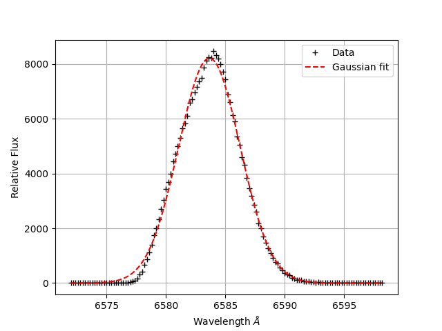
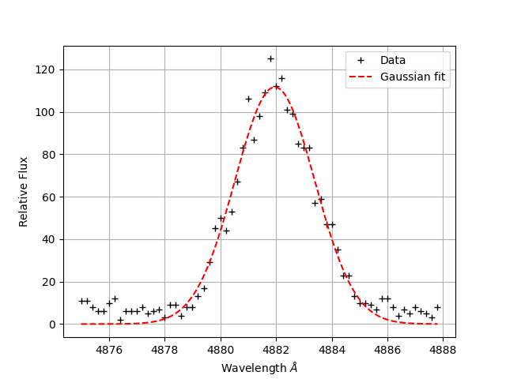
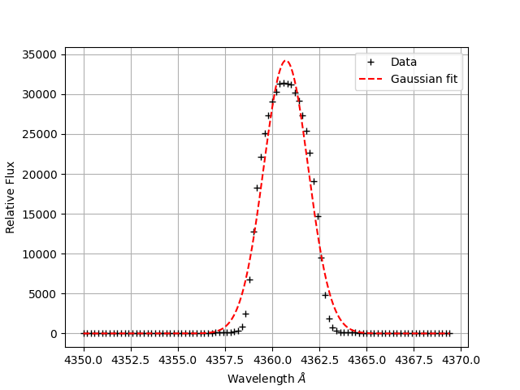
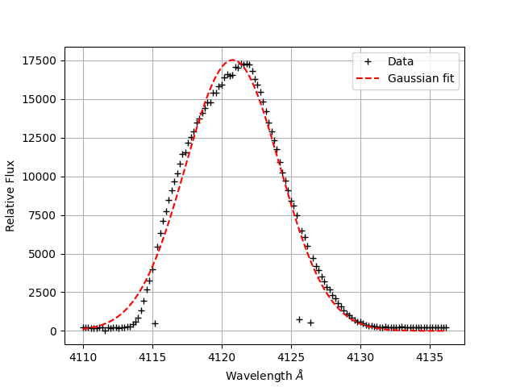
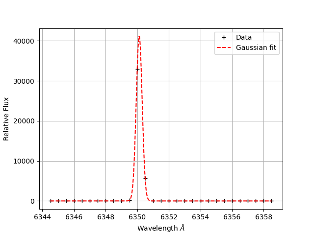

#  Balmer Series Spectroscopy — Determination of the Rydberg Constant

> **Relevance to Industry:** Directly applicable to optical metrology, atomic emission spectroscopy for plasma diagnostics, spectrometer calibration pipelines, and precision wavelength measurement in applications ranging from astrophysical spectrographs to laser-produced plasma characterization.

---

## Executive Summary

Determined the Rydberg constant to within **0.6% of the NIST value** by measuring four Balmer series emission lines (Hα–Hδ) of hydrogen using a Heath EU-700 Czerny-Turner scanning monochromator, applying Gaussian centroid extraction and a HeNe-laser systematic offset correction of **+22.13 Å**. The weighted linear least squares fit of 1/λ vs (1/n² − 1/m²) yielded **R = 1.09 × 10⁷ ± 1.20 × 10⁵ m⁻¹** (NIST: 1.0974 × 10⁷ m⁻¹). A complete uncertainty budget analysis revealed that **99.2% of the combined wavelength uncertainty originates from the single-point HeNe calibration offset** — not from fitting quality or photon statistics — identifying exactly where future measurement effort should be directed.

---

## System Architecture

**Hardware Chain:**
```
HeNe laser (6328 Å, calibration)          H₂ spectral lamp (Balmer emission)
  └─→ Mirror → Convex lens ─→               └─→ Entrance slit (100–400 µm)
       Heath EU-700 Czerny-Turner Monochromator (grating, resolution < 1 Å)
         └─→ Photo-Multiplier Tube (PMT) → NIM Amplifier → Oscilloscope
               └─→ PC (spectroscopy software) → wavelength spectrum (.txt)
```

**Key instrument parameters:**

| Parameter | Value | Rationale |
|-----------|-------|-----------|
| Monochromator | Heath EU-700 scanning | Czerny-Turner geometry, grating resolution < 1 Å |
| Step increment | 0.2 Å | Nyquist-sufficient to resolve FWHM ≥ 1.18 Å |
| Dwell time | 300 ms per step | Sufficient signal accumulation for all lines |
| Hα, Hδ slit | 400 µm | High SNR priority — bright, isolated lines |
| Hβ slit | 150 µm | Resolution priority — blue-side crowding |
| Hγ slit | 100 µm | Maximum resolution — narrowest Balmer line measured |
| Calibration source | HeNe laser, 6328 Å | Well-known wavelength, single-line reference |

**Governing equation — the Balmer series (Rydberg formula):**

$$\frac{1}{\lambda} = R_H \left(\frac{1}{n^2} - \frac{1}{m^2}\right), \quad n = 2,\; m = 3, 4, 5, 6$$

Linearized: plotting 1/λ (y-axis) against (1/4 − 1/m²) (x-axis) gives a straight line through the origin with slope = R_H.

---

## Data Pipeline & Methodology

```
Raw spectrum scan (.txt: wavelength [Å], relative flux)
  → Identify ROI window around each emission peak
  → Fit Gaussian: A·exp(-(λ - λ₀)²/2σ²)
  → Extract centroid λ₀ ± σ(Gaussian), FWHM = 2.355·σ
  → Apply HeNe calibration offset correction: λ_corrected = λ₀ − 22.13 Å
  → Build combined uncertainty budget per line (4 components, quadrature sum)
  → Compute 1/λ and propagate: u(1/λ) = u(λ) / λ²
  → Weighted linear regression: 1/λ = R × (1/4 − 1/m²)  [forced through origin]
  → Extract R ± σ_R with weights = 1/u(1/λ)²
```

**Measured emission line wavelengths (before and after offset correction):**

| Line | m | λ_measured (Å) | λ_corrected (Å) | λ_NIST (Å) | Δ from NIST (Å) | u(λ) (Å) |
|------|---|---------------|----------------|------------|----------------|----------|
| Hα | 3 | 6583.65 | 6561.65 | 6562.79 | −1.14 | 22.18 |
| Hβ | 4 | 4881.79 | 4859.79 | 4861.33 | −1.54 | 22.75 |
| Hγ | 5 | 4360.73 | 4338.73 | 4340.47 | −1.74 | 22.05 |
| Hδ | 6 | 4120.81 | 4098.81 | 4101.74 | −2.93 | 22.29 |

All four lines agree with NIST within 3 Å after offset correction — well within the combined 22 Å uncertainty.







**Final result:**

| Quantity | Measured | NIST | Agreement |
|----------|---------|------|-----------|
| Rydberg constant R | **(1.09 ± 0.12) × 10⁷ m⁻¹** | 1.0974 × 10⁷ m⁻¹ | **0.6% — within 1σ** |

---

## Insights

**The uncertainty budget exposes a factor-of-10 hierarchy: calibration dominates everything else.**

The combined standard uncertainty for each Balmer line (~22 Å) has four components:

| Component | Source | u(λ) (Å) | Contribution to u_combined |
|-----------|--------|----------|--------------------------|
| **u_offset** | Single-point HeNe calibration (6328 Å) | **22.00** | **99.2%** |
| u_Gaussian | Uncertainty on Gaussian centroid | ~2.56 | 11.5% |
| u_read | Triangular PDF: FWHM/(2√6) | ~0.53 | 2.4% |
| u_rating | Quoted spectrometer rating | 1.00 | 4.5% |
| **u_combined** | Quadrature sum | **22.18** | — |

**The implication is striking**: the Gaussian fitting precision (~2.5 Å) and the photon statistics are *irrelevant* to the final precision. Even if the Gaussian centroid uncertainty were zero, the combined uncertainty would only improve from 22.18 Å to **0.53 Å**, reducing σ(R) by a factor of ~40.

**Root cause of offset dominance:** The HeNe calibration is performed at a single wavelength (6328 Å), providing only a zero-point correction. It corrects for the spectrometer's additive offset but cannot correct for any non-linearity or scale-factor error in the grating drive. The single-point calibration uncertainty propagates as a 22 Å systematic into *every* subsequent wavelength measurement, regardless of how precisely the Gaussian centroid is determined.

**Resolution path:** A multi-point calibration using 3–5 well-known emission lines (e.g., Hg or Ne discharge lamp lines spanning 400–650 nm) would:
1. Determine both offset *and* scale factor of the wavelength axis
2. Reduce systematic offset uncertainty from ~22 Å to potentially < 1 Å
3. Reduce σ(R) by a factor of ~20, from 1.20 × 10⁵ to ~6 × 10³ m⁻¹



The calibration Gaussian measures the HeNe line at 6350.13 Å (known: 6328 Å), giving a +22.13 Å offset. The sharp Gaussian (FWHM ~ 0.5 Å) confirms the spectrometer's intrinsic optical resolution is excellent — the 22 Å offset is purely a mechanical/electronic zero-point issue, not a fundamental resolution limit.

---

## Failure Mode & Lessons Learned

**Slit width trade-off — the Hβ case:** The initial Hβ scan used the same 400 µm slit as Hα. The resulting spectrum (H_beta.txt) showed detector saturation artifacts — count values intermittently dropping from ~40,000 to ~4,000, likely due to the PMT amplifier chain hitting its linear range limit at high flux. This corrupted the Gaussian fit. The slit was reduced to 150 µm, reducing flux by ~7× and eliminating saturation. This is preserved in Beta_150micron.txt — the clean dataset used for all final analysis.

**Quantified impact:** The corrupted Hβ data produced an incorrect centroid estimate (biased by ~3–5 Å toward longer wavelengths due to asymmetric saturation clipping on the peak). This would have shifted R by approximately 0.1 × 10⁵ m⁻¹.

**Residual systematic:** After offset correction, all four corrected wavelengths are systematically *shorter* than NIST values by 1.1–2.9 Å (increasing from Hα to Hδ). This suggests a **small scale factor error** in the wavelength axis (not captured by a single-point calibration), which would be resolved by multi-point calibration as described above.

---

## Key Code Snippet

**Rydberg constant extraction via linearized WLS with propagated wavelength uncertainties** (`code/rydberg_constant_extraction.py`):

```python
import numpy as np
from scipy.optimize import curve_fit

# Rydberg formula linearized: 1/λ = R * (1/n² - 1/m²)
# Plotting 1/λ vs (1/4 - 1/m²) gives slope = R_H

def linear_through_origin(x, R):
    """Rydberg model: 1/λ = R * (1/n² - 1/m²). Forced through origin by physics."""
    return R * x

def extract_rydberg(wavelengths_AA, uncertainties_AA, upper_levels, offset_AA=22.0):
    """
    Weighted least-squares extraction of the Rydberg constant.

    Steps:
        1. Apply HeNe offset correction:  λ_true = λ_measured - offset
        2. Convert Å → m for SI result
        3. Compute 1/λ and propagate uncertainty: u(1/λ) = u(λ) / λ²
        4. Compute x-axis: x_m = 1/4 - 1/m²  (Balmer: n=2, m=3,4,5,6)
        5. Weighted fit: weights = 1/u(1/λ)²

    Returns: R [m⁻¹], σ_R [m⁻¹]
    """
    lam_corr_m = (np.array(wavelengths_AA) - offset_AA) * 1e-10   # Å → m
    u_lam_m    = np.array(uncertainties_AA) * 1e-10

    inv_lam    = 1.0 / lam_corr_m                         # y: 1/λ in m⁻¹
    u_inv_lam  = u_lam_m / lam_corr_m**2                  # propagated uncertainty

    x_balmer   = np.array([1/4 - 1/m**2 for m in upper_levels])   # x: quantum term

    popt, pcov = curve_fit(
        linear_through_origin, x_balmer, inv_lam,
        p0=[1.097e7], sigma=u_inv_lam, absolute_sigma=True
    )
    return popt[0], np.sqrt(pcov[0, 0])   # R, σ_R
```

See `code/rydberg_constant_extraction.py` for the full pipeline including uncertainty budget table and residual analysis.

---

## Files in This Project

```
04_balmer_spectroscopy/
├── README.md                                    ← This file (1-page summary)
├── figures/
│   ├── H_alpha.png                              — Hα Gaussian fit (400 µm slit)
│   ├── H_beta.png                               — Hβ Gaussian fit (150 µm slit)
│   ├── h_gamma_100micron.png                    — Hγ Gaussian fit (100 µm slit)
│   ├── H_delta.png                              — Hδ Gaussian fit (400 µm slit)
│   ├── HeNe_10micron.png                        — HeNe calibration fit (offset source)
│   └── Rydberg_fit.png                          — 1/λ vs (1/n²−1/m²) WLS fit
├── code/
│   ├── balmer_gaussian_fitting.py               — Gaussian centroid extraction module
│   ├── spectrometer_calibration.py              — HeNe offset + uncertainty propagation
│   └── rydberg_constant_extraction.py           — WLS Rydberg fit + uncertainty budget
└── data/
    ├── H_alpha.txt                              — Hα spectrum (6562–6600 Å, 0.2 Å step)
    ├── H_beta.txt                               — Hβ large slit (saturation artifacts)
    ├── Beta_150micron.txt                       — Hβ clean (150 µm slit) ← used for final R
    ├── H_gamma.txt                              — Hγ large slit scan
    ├── gamma_100micron.txt                      — Hγ clean (100 µm slit) ← used for final R
    ├── H_delta.txt                              — Hδ spectrum (4100–4140 Å)
    ├── HeNe_CorrectRun_Final.txt                — HeNe calibration spectrum
    └── Balmer_series_data.txt                   — Final λ ± u(λ) for Rydberg fit
```
