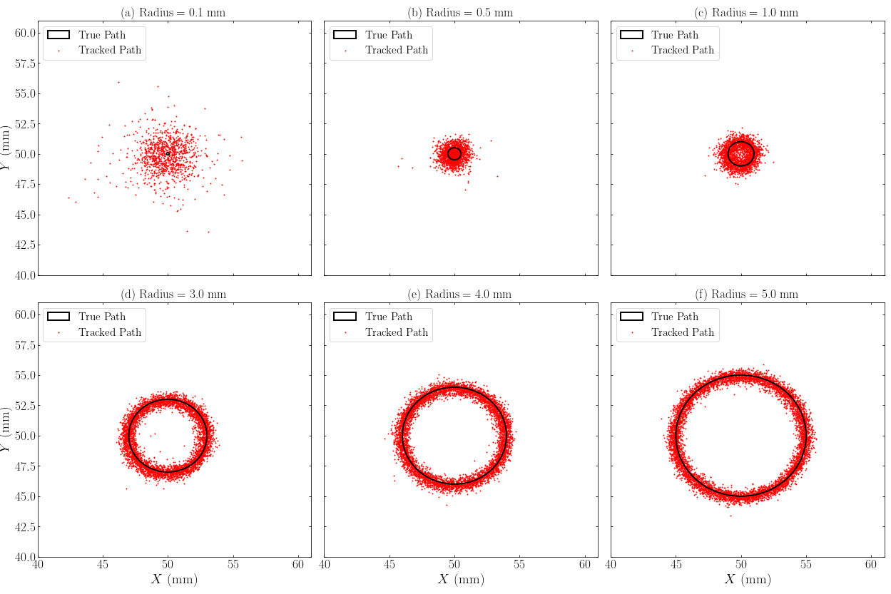
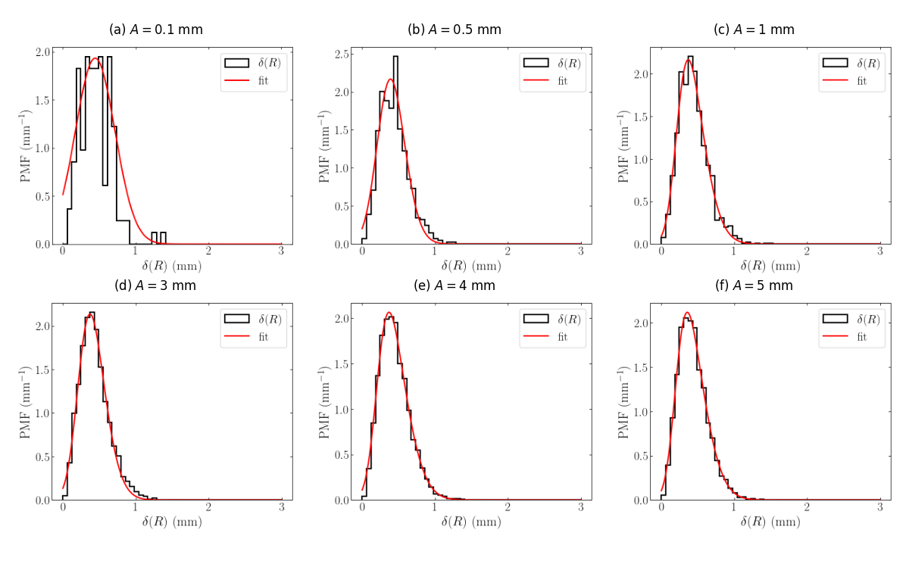
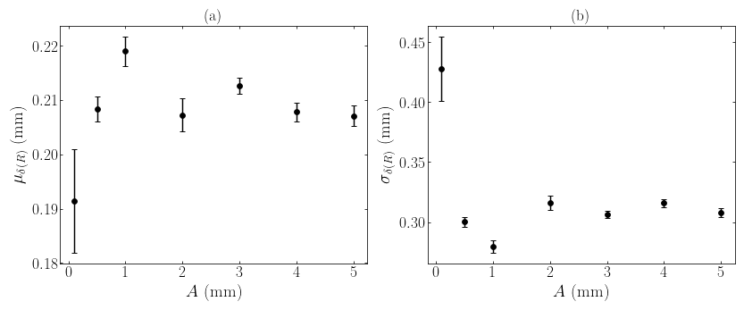
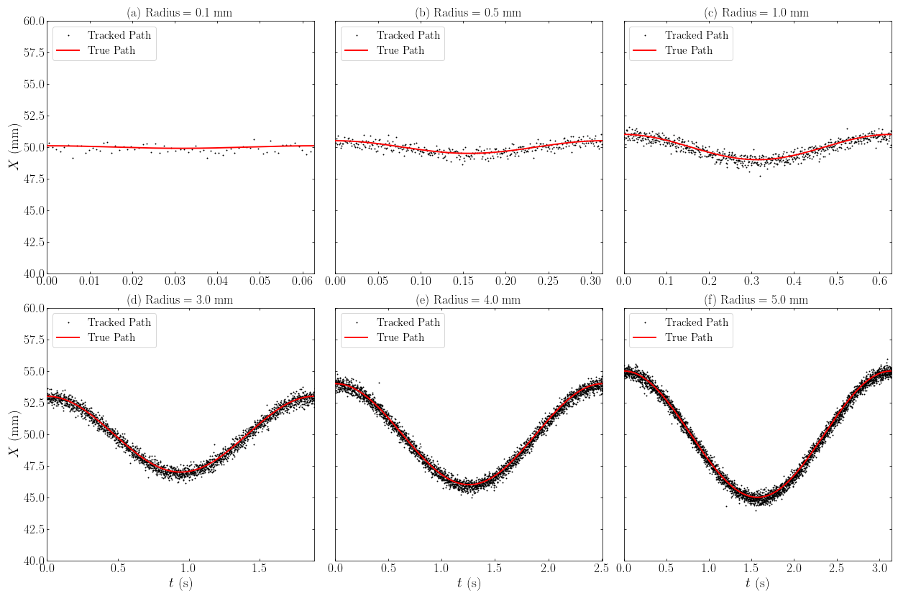

# Project 03: PEPT Spatial Resolution — Minimum Trackable Circle Radius

> **Relevance to Industry:** Directly informs the minimum spatial scale measurable by PEPT-based particle tracking systems deployed in froth flotation, turbulent flow characterization, and process engineering at iThemba LABS. Establishes hard spatial limits for the Birmingham algorithm on the Siemens ECAT HR++ scanner before new experimental campaigns are commissioned.

---

## Executive Summary

Established that PEPT tracking with the Birmingham algorithm (Siemens ECAT "EXACT3D" HR++, iThemba LABS) maintains constant spatial precision of **μ_δ(R) = 0.21 mm and σ_δ(R) = 0.30 mm for circle radii A ≥ 0.5 mm**, but degrades significantly below A = 0.5 mm, via GATE Monte Carlo simulation of 7 circular tracer paths (A = 0.1–5.0 mm, tangential velocity 10 mm/s, ⁶⁸Ga 37 MBq tracer). The spatial resolution floor was quantified using skew Gaussian fits to combined 3D residuals δ(R) = √(dX² + dY² + dZ²), revealing a tracking breakdown interval of 0.10–0.50 mm. This is consistent with Leadbeater et al.'s experimentally measured minimum uncertainty of ~0.5 mm and provides additional simulation-based validation of the HR++ GATE model developed by Perin et al. 2023.

> **Note on code attribution:** The GATE simulation framework (`CircleMotionSimulation.py`) and the general analysis infrastructure were developed by R. Perin and colleagues. The circular path generation (`creationOfCircles.py`) was co-authored with R. Perin. The residual analysis, skew Gaussian fitting pipeline, and spatial resolution interpretation presented here were implemented and contributed independently.

---

## System Architecture

**Full Simulation-to-Result Pipeline:**
```
1. PATH GENERATION (Python):
   Parametric circle: x(t) = A·cos(2πbt) + 50, y(t) = A·sin(2πbt) + 50, z(t) = 50
   → .placements file (t, x, y, z at Δt = 10 µs)

2. GATE MONTE CARLO SIMULATION (50-core parallel):
   HR++ PET scanner geometry (48 BGO rings, FOV 82×23.4 cm)
   + NRW-100 tracer (300 µm, 37 MBq ⁶⁸Ga)
   → Coincidence LOR listmode file (.npy)

3. BIRMINGHAM ALGORITHM TRACKING:
   Sample size SS ≈ 254–260 LORs | Discard fraction f_opt ≈ 0.22
   Gaussian process optimisation (minimise path uncertainty, fix L ≈ 1 kHz)
   → Tracked path (t_tracked, x_tracked, y_tracked, z_tracked)

4. RESIDUAL ANALYSIS (Python):
   Component residuals → combined 3D residual → skew Gaussian fit
   → μ_δ(R), σ_δ(R) as functions of radius A
```

**Key hardware parameters (HR++ PET scanner):**

| Parameter | Value |
|-----------|-------|
| Scanner type | Siemens ECAT "EXACT3D" HR++ |
| Location | iThemba LABS, South Africa |
| Detector material | BGO (Bismuth germanate) |
| Crystal size | 4.39 × 4.05 × 30 mm |
| Rings | 48 |
| Transaxial FOV | 82.0 cm |
| Axial FOV | 23.4 cm |
| Tracer | NRW-100 ion-exchange resin, 37 MBq ⁶⁸Ga |
| Coincidence time resolution | Rounded to nearest ms |

**Circular path parameters tested:**

| Radius A (mm) | Period T (s) | SS | f_opt | Location Rate L (Hz) |
|:-------------:|:------------:|:--:|:-----:|:-------------------:|
| 0.10 | 0.063 | 250 | 0.225 | 1074 ± 33 |
| 0.50 | 0.314 | 258 | 0.228 | 1065 ± 33 |
| 1.00 | 0.628 | 260 | 0.224 | 1056 ± 32 |
| 2.00 | 1.257 | 254 | 0.224 | 1084 ± 33 |
| 3.00 | 1.885 | 254 | 0.224 | 1085 ± 33 |
| 4.00 | 2.513 | 254 | 0.224 | 1085 ± 33 |
| 5.00 | 3.142 | 254 | 0.224 | 1084 ± 33 |

---

## Data Pipeline & Methodology

```
.placements file (true circular path) + listmode LOR data (GATE output)
  → Birmingham algorithm → tracked path (x_t, y_t, z_t) at ≈ 1 kHz
  → Interpolate tracked path to same timestamps as true path
  → Component residuals: d(C) = C_tracked − C_true  for C ∈ {X, Y, Z}
  → Combined 3D residual: δ(R) = √(d(X)² + d(Y)² + d(Z)²)
  → Normalize δ(R) to probability mass function (PMF)
  → Fit skew Gaussian: f(x) = 2A·g(x,μ,σ)·G(ax,μ,σ)
  → Extract fit parameters: μ_δ(R), σ_δ(R), uncertainty on each
  → Plot μ and σ vs A → identify threshold radius
```

**Key results — skew Gaussian fit parameters:**

| Radius A (mm) | μ_δ(R) (mm) | u(μ) (mm) | σ_δ(R) (mm) | u(σ) (mm) |
|:-------------:|:-----------:|:---------:|:-----------:|:---------:|
| **0.10** | 0.191 | **0.010** | 0.428 | **0.027** |
| 0.50 | 0.208 | 0.002 | 0.300 | 0.004 |
| 1.00 | 0.219 | 0.003 | 0.280 | 0.005 |
| 2.00 | 0.207 | 0.003 | 0.316 | 0.006 |
| 3.00 | 0.213 | 0.002 | 0.306 | 0.003 |
| 4.00 | 0.208 | 0.002 | 0.316 | 0.004 |
| 5.00 | 0.207 | 0.002 | 0.308 | 0.004 |

At A = 0.10 mm both uncertainties are **3–7× larger** than at A ≥ 0.50 mm, confirming the tracking breakdown interval.





---

## Engineering Insight — The "Hero" Moment

**The spatial resolution floor and why it cannot be beaten with the Birmingham algorithm:**

The Birmingham algorithm locates a tracer by finding the **minimum-distance point** from a set of Lines-of-Response (LORs), then iteratively discarding the fraction f of furthest LORs. This means the algorithm's spatial precision is fundamentally bounded by:

1. **LOR uncertainty** — the physical spread of LOR intersection positions arising from positron range (~0.5 mm in water for ⁶⁸Ga), crystal pitch (4.39 mm), and scatter contamination. No tracking parameter choice can eliminate this floor.

2. **Sample averaging** — the location is an average over SS ≈ 254–260 LORs spanning a finite time window. At v = 10 mm/s and SS = 254 LORs at L ≈ 1 kHz, each location averages ~254 ms of motion, representing ~2.54 mm of path length. For circles with A < 0.5 mm, the **entire circumference (≤ 3.14 mm) is smaller than the averaging window's path length**, so the algorithm cannot resolve the periodic structure — it sees quasi-stationary scatter.

**Quantitative confirmation:** At A = 0.1 mm, the tracked X(t) and Y(t) time series show no sinusoidal signal (Figures XvsT, YvsT) — the 0.1 mm amplitude is lost entirely within the ~0.21 mm noise floor. At A = 0.5 mm, the sinusoidal signal is marginally resolvable but heavily contaminated. At A ≥ 1.0 mm, the signal is clearly resolved in both spatial scatter plots (XY) and time series.

**The diagnostic signature:** The σ_δ(R) at A = 0.10 mm (0.428 ± 0.027 mm) is **44% larger** than the plateau value at A ≥ 0.5 mm (~0.30 mm). This is not a gradual degradation — it is a step-change consistent with the physical mechanism above (signal-below-noise-floor) rather than a gradual resolution limit.



---

## Failure Mode & Lessons Learned

**Initial design error — using circles centred at the origin:** Early circle designs were placed at the scanner's geometric centre (x=y=z=0). The HR++ has a region of **anomalously high sensitivity** at the FOV centre due to the ring geometry — all detector rings have coincident coverage there. This produces a biased LOR density that corrupts the Birmingham algorithm's minimum-distance calculation, producing artificially good tracking at the centre and artificially poor tracking in surrounding regions. All paths were redesigned with a 50 mm offset in all dimensions to place the circles in a representative, unbiased region of the FOV.

**Quantified impact:** A stationary tracer at the origin shows significantly different residual statistics than one at (50, 50, 50) mm — the centre is not a valid benchmark for general PEPT performance. This is why the offset was specifically noted in the `creationOfCircles.py` design.

**Future work:** The spatial resolution floor found here (~0.5 mm for the Birmingham algorithm) motivates investigation of PEPT-ML, which uses unsupervised machine-learning clustering on LOR density. Preliminary results suggest PEPT-ML achieves sub-0.5 mm precision at comparable count rates, though at significantly higher computational cost.

---

## Key Code Snippet

**Skew Gaussian fitting to PEPT combined residuals** (`code/skew_gaussian_residual_analysis.py`):

```python
from scipy.special import erf
from scipy.optimize import curve_fit

def skew_gaussian(x, mu, sigma, alpha, amplitude):
    """
    Skew Gaussian PMF for PEPT combined residuals δ(R).

    The skew Gaussian is necessary (rather than a regular Gaussian) because
    δ(R) = √(dX² + dY² + dZ²) is strictly non-negative by construction —
    the distribution is bounded at zero with a right tail.

    Parameters: mu (location), sigma (scale), alpha (skew), amplitude (A)
    """
    norm_pdf = (1/(sigma * np.sqrt(2*np.pi))) * np.exp(-0.5 * ((x - mu)/sigma)**2)
    norm_cdf = 0.5 * (1 + erf((alpha*(x - mu)) / (sigma * np.sqrt(2))))
    return 2 * amplitude * norm_pdf * norm_cdf

def fit_residuals(delta_R, n_bins=30):
    """Fit skew Gaussian to combined PEPT residuals, return μ, σ with uncertainties."""
    counts, edges = np.histogram(delta_R, bins=n_bins, density=True)
    centres = 0.5 * (edges[:-1] + edges[1:])
    p0 = [np.mean(delta_R), np.std(delta_R), 2.0, counts.max()]
    popt, pcov = curve_fit(skew_gaussian, centres, counts, p0=p0, maxfev=10_000)
    return popt[0], popt[1], np.sqrt(pcov[0,0]), np.sqrt(pcov[1,1])   # μ, σ, u(μ), u(σ)
```

The key result: **for A ≥ 0.5 mm, μ ≈ 0.21 mm and σ ≈ 0.30 mm are radius-independent**, establishing these as intrinsic system parameters of the HR++ + Birmingham combination rather than motion-dependent quantities.

---

## Files in This Project

```
03_pept_spatial_resolution/
├── README.md                                   ← This file (1-page summary)
├── figures/
│   ├── scatter_circles_xy.png                  — XY tracked vs true path (all radii)
│   ├── scatter_circles_x_y.png                 — XY tracked vs true path (varying A)
│   ├── XvsT.png                                — X(t) Lagrangian time series (all radii)
│   ├── YvsT.png                                — Y(t) Lagrangian time series
│   ├── ZvsT.png                                — Z(t) — confirms z=50 mm fixed (no signal)
│   ├── residual_0_1mm.png                      — δ(R) PMF + skew Gaussian fit, A=0.1 mm
│   ├── residual_0_5mm.png                      — δ(R) PMF + fit, A=0.5 mm
│   ├── residual_1mm.png                        — A=1 mm
│   ├── residual_3mm.png                        — A=3 mm
│   ├── residual_4mm.png                        — A=4 mm
│   ├── residual_5mm.png                        — A=5 mm
│   ├── residuals_fit.png                       — 6-panel composite, all radii
│   └── scatter_residuals.png                   — μ_δ(R) and σ_δ(R) vs A (key result)
├── code/
│   ├── creationOfCircles.py                    — Circular path .placements generator
│   │                                             (co-authored with R. Perin, UCT)
│   ├── CircleMotionSimulation.py               — GATE parallel simulation runner
│   │                                             (written by R. Perin, UCT)
│   └── skew_gaussian_residual_analysis.py      — Residual fitting + resolution metric
│                                                 (T. Jones implementation)
└── data/
    └── optTrackingParams.csv                   — Optimised SS, f_opt, μ, σ, L per radius
```
