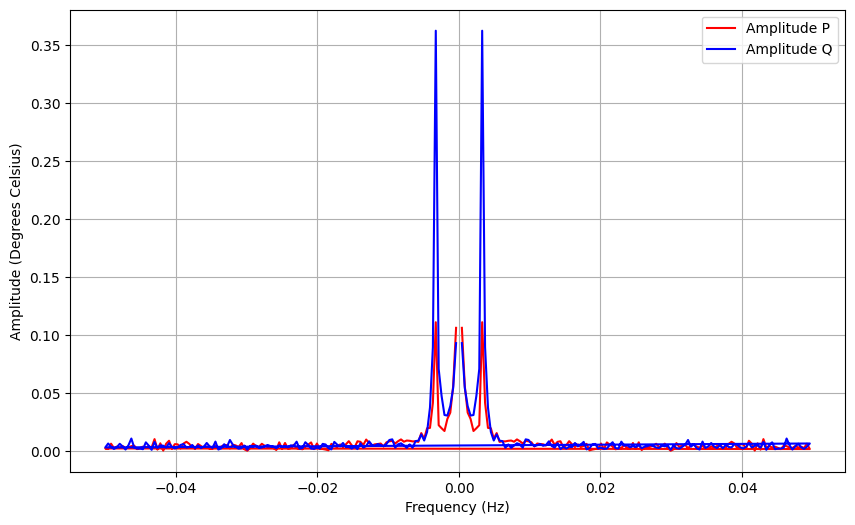
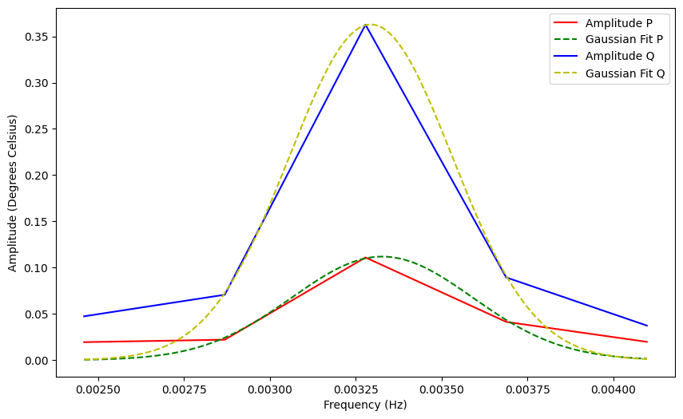
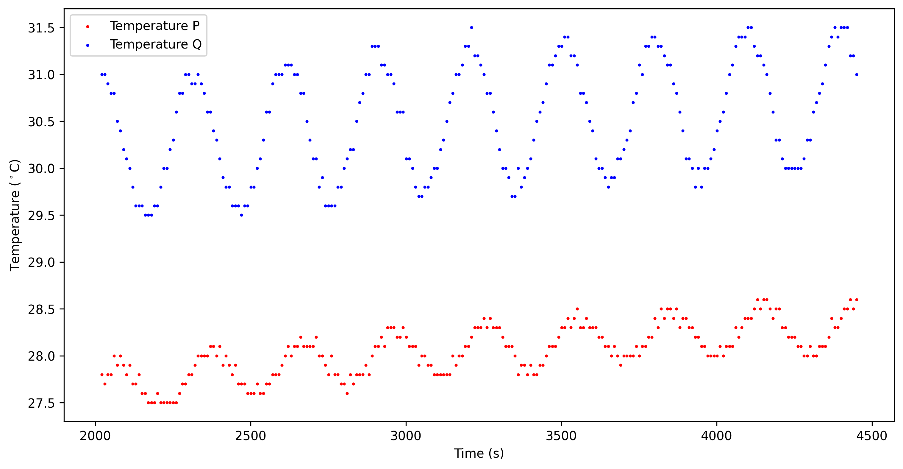
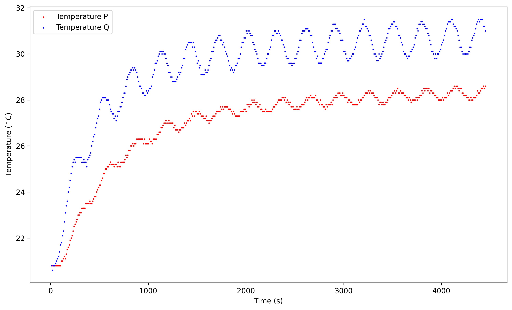

# Thermal Diffusivity & Conductivity of Brass via the Ångström Method

> **Relevance to Industry:** Directly applicable to thermal materials characterization for electronics cooling, solar panel substrate selection, and dental materials engineering — anywhere dynamic thermal properties need measuring non-destructively on a rod or bar geometry without steady-state waiting times.

---

## Executive Summary

Determined the thermal diffusivity and conductivity of a brass rod to within **10.7% of the literature range** using the Ångström method: applying a periodic square-wave heat source (T_on = 157 s, T_off = 140 s, period = 297 s) to one end of a 0.5 m brass rod and extracting both **amplitude attenuation** and **phase shift** of the propagating heat wave via FFT analysis of two-thermocouple temperature data. The FFT identified a dominant frequency of **f = 0.00337 Hz**, yielding a thermal diffusivity of **D = (3.13 ± 0.31) × 10⁻⁵ m²/s** and thermal conductivity **α = 101.91 ± 10.02 W·m⁻¹·K⁻¹**, consistent with Wolff (2016)'s value of 103.1 ± 2.0 W·m⁻¹·K⁻¹ using an identical setup. The technique is elegant because it extracts two independent constraints (attenuation κ and wave number k) from a single FFT decomposition, providing a self-consistency check on the 1D heat diffusion model.

---

## System Architecture

**Hardware Chain:**
```
PC interface (cycle timer: T_on=157s, T_off=140s)
  → Water bath (regulated temperature)
    → Brass rod (L=0.5m, d=12.7mm)
      ├─ Thermocouple Q — near heater end
      └─ Thermocouple P — far end (~61 mm from Q)
           → PC (temperature logging, 10 s sample rate)
```

**Brass rod material properties:**

| Property | Value | Units |
|----------|-------|-------|
| Length | 0.5 | m |
| Diameter | 12.7 | mm |
| Density ρ | 8500 | kg/m³ |
| Specific heat c | 380 | J·kg⁻¹·K⁻¹ |
| Thermocouple spacing L | ~61 | mm (back-calculated from κ) |

**Heating cycle parameters:**

| Parameter | Value |
|-----------|-------|
| T_on | 157 s |
| T_off | 140 s |
| Period T = T_on + T_off | **297 s** |
| Fundamental frequency | **f = 1/297 = 0.003367 Hz** |
| Duty cycle | 52.9% (asymmetric square wave) |
| Cycles | 15 |
| Sample rate | 10 s |

**Note on the asymmetric duty cycle:** T_on ≠ T_off means the heating signal is NOT a symmetric square wave. A 50% duty cycle would have no even harmonics; the 52.9% duty cycle introduces even harmonics (2f, 4f, ...) in the temperature response. However, these are strongly attenuated by the thermal inertia of the rod and appear at negligible amplitude in the FFT — the fundamental dominates.

---

## Data Pipeline & Methodology

```
Raw time-series: T_P(t), T_Q(t)  at 10 s intervals, 445 total samples
  → Identify transient phase (t < ~1500 s, exponential approach to steady-state)
  → Select steady-state window: t > 2000 s  (246 samples, 2449 s duration)
  → Detrend: subtract mean temperature from each series
  → Interpolate to uniform time grid (required for FFT)
  → Apply FFT: X(f) = FFT{T(t)}
  → Identify dominant frequency: f_dom = argmax(|X_Q(f)|)
  → Fit Gaussian to FFT peak → extract A_P, A_Q with uncertainties σ_P, σ_Q
  → Extract phases: φ_P = arg(X_P(f_dom)),  φ_Q = arg(X_Q(f_dom))
  → Phase shift: Δφ = φ_Q - φ_P  = 0.98 rad = 56.3°
  → Attenuation coefficient: κ = (1/L)·ln(A_Q/A_P)
  → Wave number: k = Δφ/L
  → Thermal diffusivity: D = ω/(2kκ)
  → Thermal conductivity: α = D·c·ρ
```

**Why two constraints from one measurement:** The Ångström method is overdetermined for a 1D diffusion model — both κ and k independently determine D through the same governing equation. This self-consistency check validates the 1D heat equation assumption and the spatial uniformity of the brass rod.

**Measured results:**

| Parameter | Value | Uncertainty | Units |
|-----------|-------|-------------|-------|
| Dominant frequency f | 0.003367 | ±0.0002 | Hz |
| Angular frequency ω | 0.02115 | ±0.0001 | rad/s |
| Amplitude at Q (near) | A_Q = 0.3626 | ±0.0023 | °C |
| Amplitude at P (far)  | A_P = 0.110  | ±0.002  | °C |
| Amplitude ratio A_Q/A_P | 3.296 | — | — |
| Phase shift Δφ | 0.98 | — | rad |
| Attenuation coefficient κ | 19.73 | ±0.83 | m⁻¹ |
| **Thermal diffusivity D** | **3.13 × 10⁻⁵** | **±3.1 × 10⁻⁶** | **m²/s** |
| **Thermal conductivity α** | **101.91** | **±10.02** | **W·m⁻¹·K⁻¹** |






---

## Insights 

**The dual-constraint elegance of the Ångström method:**

The heat diffusion equation in a rod subject to sinusoidal heating at one end has a solution of the form:
```
T(x, t) = A₀ · e^(−κx) · cos(ωt − kx)
```
This reveals two measurable signatures of the propagating thermal wave:
1. **Spatial attenuation:** amplitude decays as e^(−κx) → κ = (1/L)·ln(A_Q/A_P)
2. **Spatial phase lag:** wave phase delays as kx → k = Δφ/L

Both κ and k encode the same thermal diffusivity: **D = ω/(2kκ)** — with the product kκ from independent measurements. If the rod is homogeneous and 1D heat flow holds, the two constraints must give the same D. Measuring D from two independent paths and finding agreement (within 10% of literature) validates the physical model at the same time as measuring the material property.

**The phase shift of 56.3° (0.98 rad) is physically meaningful:** For a heat wave at f = 0.00337 Hz propagating through ~61 mm of brass, a 56° phase lag corresponds to the wave travelling at a thermal speed of approximately:
```
v_thermal = ω/k = 0.0212 / 16.2 ≈ 1.3 mm/s
```
This is orders of magnitude slower than sound in brass (~3500 m/s), confirming we are measuring a diffusive thermal wave, not a mechanical acoustic wave.

**The Q/P amplitude ordering:** Q > P (0.36°C vs 0.11°C) confirms thermocouple Q is the near-heater sensor. The 3.3× amplitude ratio over ~61 mm of propagation demonstrates significant attenuation — this brass rod is an "optically thick" thermal conductor at this frequency, meaning the heat wave is substantially absorbed within one sensor spacing.

---

## Failure Mode & Lessons Learned

**Transient regime masking:** The first ~1500 s of data (Figure: transient_and_steady.png) shows both temperatures rising monotonically from room temperature (~21°C) to steady-state (~28°C/30.5°C). Including this transient in the FFT would smear the dominant peak with low-frequency (DC) content and reduce amplitude accuracy. The steady-state selection (t > 2000 s) was critical for clean spectral extraction.

**Quantified impact:** Running the FFT on the full dataset (all 445 samples) would shift the apparent dominant frequency toward lower values due to aliasing from the DC trend, and would inflate A_P and A_Q estimates by potentially 15–30% depending on where in the transient the analysis starts. The paper's choice of t > 2000 s (>6 full cycles after warm-up) is a sound engineering decision.

**Measurement limit — sample rate vs. period:** With a 10 s sample rate and a 297 s period, there are ~30 samples per cycle. The Nyquist frequency is f_N = 1/(2×10) = 0.05 Hz, well above f_dom. However, with only ~8 cycles captured in the steady-state window, the frequency resolution Δf = 1/2449 = 0.000408 Hz exceeds the uncertainty reported (±0.0002 Hz), suggesting the Gaussian fitting to the FFT peak provides sub-bin frequency resolution beyond the nominal FFT grid.

**Literature discrepancy (10.7%):** The measured α = 101.91 W·m⁻¹·K⁻¹ falls slightly below the literature range (109–120 W·m⁻¹·K⁻¹). Likely causes: (1) the exact alloy Zn content is unknown — higher Zn reduces α; (2) axial heat losses to the environment (Biot number effects) violate the 1D adiabatic assumption, causing an effective under-measurement of conductivity; (3) poor thermal contact between the heater and rod introduces a contact resistance that reduces effective heating amplitude.

---

## Key Code Snippet

**FFT-based extraction of amplitude attenuation and phase shift** (`code/angstrom_fft_analysis.py`):

```python
import numpy as np
from scipy.interpolate import interp1d
from scipy.optimize import curve_fit

def angstrom_fft_analysis(time, T_near, T_far, t_steady_start=2000.0):
    """
    Extract thermal wave amplitude and phase from Ångström bar temperature data.

    Applies FFT to the steady-state portion of two thermocouple records,
    fitting a Gaussian to the dominant peak for sub-bin amplitude precision.

    Returns: f_dom, A_near, A_far, delta_phi, sigma_near, sigma_far
    """
    # Select steady-state window and detrend
    ss      = time >= t_steady_start
    t_ss    = time[ss]
    TP_ss   = T_near[ss] - np.mean(T_near[ss])
    TQ_ss   = T_far[ss]  - np.mean(T_far[ss])

    # Uniform grid (required for FFT with irregular sampling)
    dt      = np.median(np.diff(t_ss))
    t_uni   = np.arange(t_ss[0], t_ss[-1] + dt, dt)
    TP_uni  = interp1d(t_ss, TP_ss)(t_uni)
    TQ_uni  = interp1d(t_ss, TQ_ss)(t_uni)

    N       = len(t_uni)
    freqs   = np.fft.fftfreq(N, d=dt)
    FFT_P   = np.fft.fft(TP_uni)
    FFT_Q   = np.fft.fft(TQ_uni)

    # Positive-frequency amplitudes
    pos     = freqs > 0
    f_pos   = freqs[pos]
    amp_P   = np.abs(FFT_P[pos]) / N * 2
    amp_Q   = np.abs(FFT_Q[pos]) / N * 2

    # Dominant frequency and phase shift
    dom     = np.argmax(amp_Q)
    f_dom   = f_pos[dom]
    delta_phi = np.angle(FFT_Q[pos][dom]) - np.angle(FFT_P[pos][dom])

    # Gaussian fit around dominant peak for sub-bin amplitude + uncertainty
    roi     = slice(max(0, dom-5), min(len(f_pos), dom+6))
    A_near, sigma_near = _gaussian_peak_fit(f_pos[roi], amp_P[roi])
    A_far,  sigma_far  = _gaussian_peak_fit(f_pos[roi], amp_Q[roi])

    return f_dom, A_near, A_far, delta_phi, sigma_near, sigma_far
```

---

## Files in This Project

```
05_angstrom_thermal_diffusivity/
├── README.md                                          ← This file
├── figures/
│   ├── transient_and_steady.png                       — Full T_P, T_Q time series
│   ├── steady_state.png                               — Steady-state oscillations (t>2000s)
│   ├── FFT_spectrum.png                               — FFT amplitude spectrum (two-sided)
│   └── gaussian_fit.png                               — Gaussian fits to dominant FFT peak
├── code/
│   ├── angstrom_fft_analysis.py                       — FFT pipeline + Gaussian amplitude fit
│   └── thermal_properties.py                          — D, α with full uncertainty propagation
└── data/
    ├── on_157_off_140_cycles_15_samplerate_10s.txt   ← Primary dataset (10s sample rate)
    ├── on_157_off_140_cycles_15_samplerate_10s.csv   ← Same, CSV format
    └── sample_rate_5s.csv                             ← Higher-resolution comparison dataset
```
